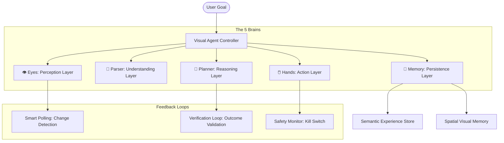

# ViZioN System Architecture

ViZioN is a high-autonomy Visual AI Agent built on a **Recursive See-Think-Act Loop** with active verification and memory persistence.

## 🏗️ High-Level Component Diagram

---

## 🛡️ Core Layers

### 1. 👁️ Perception Layer (Eyes)
*   **VLM (Qwen3-VL):** Handles semantic visual grounding and complex reasoning.
*   **OCR (PaddleOCR):** Provides high-precision text maps for document-heavy tasks.
*   **Smart Polling:** Uses **SSIM** to compare consecutive frames. If similarity > 99%, the agent enters an "idle/wait" state to save GPU resources.

### 2. 🧩 Understanding Layer (Parser)
*   **JSON Repair:** A regex-based "Self-Healing" parser that fixes common LLM syntax errors (trailing commas, unquoted keys) before they reach the reasoning engine.
*   **UI Scene Graph:** Structures raw visual signals into actionable components with bounding boxes and descriptions.

### 3. 💾 Memory Layer (Persistence)
*   **Contextual History:** A short-term sliding window of the last 5 actions.
*   **Spatial Memory:** Injects visual markers (Red Crosses) into the input image so the VLM can "see" where it just clicked.
*   **Semantic Long-Term Memory:** Uses `sentence-transformers` (all-MiniLM-L6-v2) to store and retrieve successful strategies based on goal similarity.

### 4. 🤔 Reasoning Layer (Planner)
*   **Multi-Step Planning:** Decomposes high-level goals into atomic actions.
*   **Verification:** For every action, the planner generates an **Expected Visual Outcome**. The next loop cycle begins by verifying if this outcome was met.

### 5. 🖱️ Action Layer (Hands)
*   **Desktop Executor:** Cross-platform GUI control via PyAutoGUI.
*   **Mock Executor:** Headless logging for development and testing.
*   **Lazy Loading:** Actuators are only loaded when needed, preventing crashes in headless or CI/CD environments.

---

## 🚦 Safety Mechanisms
*   **Global Kill Switch:** A background listener monitors the **ESC** key to halt all desktop interactions immediately.
*   **Failsafe:** PyAutoGUI failsafe is enabled (mouse to corner of screen).
*   **Verification Gate:** Blocks the agent from proceeding if a critical state change was expected but not detected.
