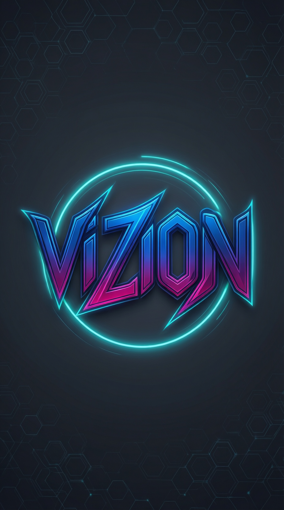

# ViZioN



**ViZioN** is a production-ready Visual AI Agent designed to perceive, reason, and act within user interfaces. It leverages the cutting-edge **Qwen3-VL** Vision-Language Model to achieve human-level visual cognition.

## 🧠 Mental Model: The 5 Brains

ViZioN is architected around five core cognitive components:

1.  👁️ **Eyes (Perception):** The Vision-Language Model (`Qwen3-VL`) and optional structural detectors.
2.  🧩 **Parser (Understanding):** Extracts structured elements, layout, and text from raw visual signals.
3.  🧠 **Reasoner (Logic):** Interprets user intent and the current state of the UI.
4.  🤔 **Planner (Strategy):** Decides the sequence of actions and what should happen next.
5.  🖱️ **Hands (Execution):** Performs the actual clicks, typing, and API calls.

## 🛠️ Architecture

ViZioN operates on a high-fidelity "See-Think-Act" loop:

*   **Semantic Understanding:** Uses `Qwen3-VL-8B-Instruct` for deep visual grounding.
*   **Structural Grounding:** Optional integration with `PaddleOCR` for verifiable text maps.
*   **Actionable UI Scene Graph:** Converts implicit visual knowledge into a first-class, verifiable representation.
*   **Action Layer:** Supports **Mock** (logging) and **Desktop** (PyAutoGUI) execution.

## 🚀 Getting Started

### Prerequisites

*   Linux / macOS / Windows
*   **Python 3.11**
*   NVIDIA GPU (Recommended: 24GB+ VRAM)
*   Conda

### Installation

1.  **Clone and Enter:**
    ```bash
    git clone https://github.com/your-username/ViZioN.git
    cd ViZioN
    ```

2.  **Create the Environment:**
    ```bash
    conda create -n vision_env python=3.11 -y
    conda activate vision_env
    pip install -r requirements.txt
    ```

3.  **Configure Environment:**
    Copy the template and add your Hugging Face token:
    ```bash
    cp .env.example .env
    # Edit .env to add your HF_TOKEN
    ```

### Usage

**Basic Run (Mock Mode):**
```bash
conda run -n vision_env python main.py \
  --image "examples/screenshot.png" \
  --goal "Click on the Login button" \
  --mode mock
```

**Enable Dedicated OCR:**
```bash
conda run -n vision_env python main.py \
  --image "docs/invoice.png" \
  --goal "Extract the total amount" \
  --use_ocr
```

## 🏭 Production Deployment

### 1. Hardware
*   **GPU:** NVIDIA RTX 3090/4090 or A100/H100 (24GB VRAM minimum for 8B models).

### 2. System Dependencies (Linux)
```bash
sudo apt-get update
sudo apt-get install -y scrot python3-tk python3-dev libx11-dev
```

### 3. Model Access
Authentication is handled automatically via the `HF_TOKEN` in your `.env` file. ViZioN uses `AutoModelForVision2Seq` with `trust_remote_code=True` to support the latest Qwen3 architectures.

### 5. Running as a Service
For production API access, you can wrap the agent in a FastAPI server (see `src/api.py` - coming soon) and run with Gunicorn:
```bash
gunicorn -w 1 -k uvicorn.workers.UvicornWorker src.api:app
```

## 📂 Project Structure

*   `src/perception`: VLM, OCR, Layout detection, and Scene Graph schema.
*   `src/reasoning`: Planner and decision-making logic.
*   `src/understanding`: Output parsing (JSON extraction).
*   `src/action`: Execution engines (Mock, Desktop).
*   `tests/`: Unit tests.

## 📜 License

[MIT License](LICENSE)
